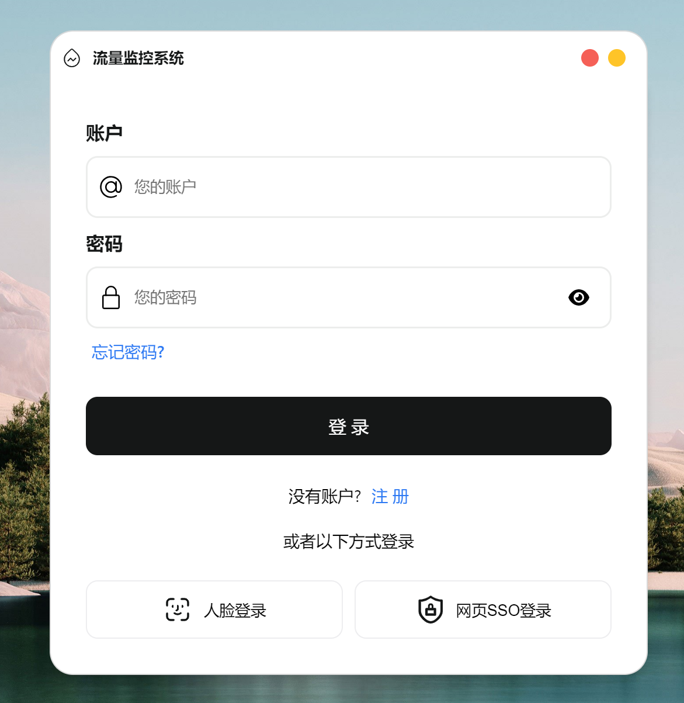
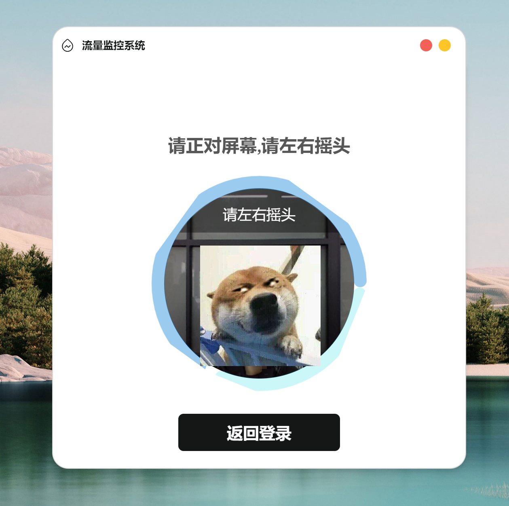
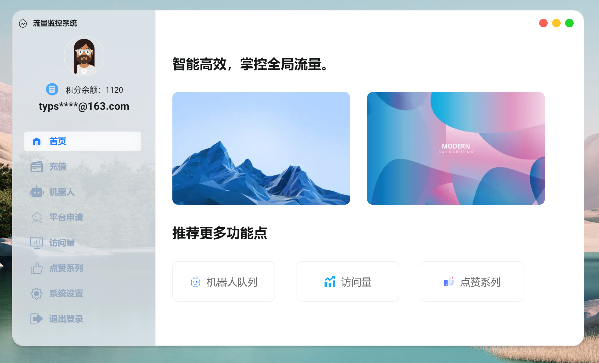

# 🌟 Electron + Vue3 Desktop App Template

<p align="center">
  
</p>


> 🚀 一个基于 Electron 和 Vue3 的跨平台桌面应用开发模板，助你快速构建现代化的桌面应用程序。

---

## 🎉 项目亮点

- **跨平台支持**：一次开发，支持 Windows、macOS 和 Linux。
- **人脸登录功能**：集成 effet.js，支持人脸识别登录。
- **自定义导航栏**：实现窗口的最小化、放大缩小和关闭等功能。
- **响应式窗口管理**：根据屏幕大小动态调整窗口尺寸。
- **SSO 登录集成**：支持单点登录功能，增强企业级应用开发能力。
- **基于现代技术栈**：
  - Electron 25.x
  - Vue 3.x（兼容 Vue 2.x 语法，降低学习成本）
  - Vite 高效打包
  - Node.js 集成

---

## 📸 页面展示

### 登录页面


### 人脸识别登录



### 主界面



---

## 🛠️ 安装与运行

### 克隆仓库

#### GITEE
```bash
git clone https://gitee.com/susantyp/flow-system.git
```
#### GITHUB
```bash
git clone https://github.com/typsusan/flow-system.git
```

### 安装依赖

```bash
npm install
```

### 启动项目

```bash
npm run dev
```

### 打包应用

```bash
npm run build
```

---

## 📂 目录结构

```plaintext
.
├── src
│   ├── main           # 主进程代码
│   ├── renderer       # 渲染进程代码（前端页面）
│   ├── preload        # 预加载脚本
│   └── assets         # 静态资源
├── public             # 公共静态文件
├── package.json       # 项目依赖配置
├── vite.config.js     # Vite 配置文件
└── README.md          # 项目说明文件
```

---

## ✨ 功能介绍

### 自定义导航栏

- **核心功能**：窗口最小化、最大化、恢复原始尺寸。
- **实现方式**：通过主进程和渲染进程的 IPC 通信完成。

### 人脸登录功能

- **技术依赖**：使用 effet.js 实现人脸识别。
- **实现步骤**：
  1. 初始化 effet.js。
  2. 捕获用户人脸信息，调用后端接口进行认证。
  3. 认证成功后跳转至主页面。

### SSO 登录

- **功能描述**：
  - 打开系统默认浏览器进行单点登录。
  - 捕获登录后的回调信息，完成登录状态更新。

---

## 🔗 项目开源地址

GitHub: [https://github.com/typsusan/flow-system](https://github.com/typsusan/flow-system)

GITEE: [https://gitee.com/susantyp/flow-system](https://gitee.com/susantyp/flow-system)

---

## ❤️ 支持这个项目

如果你觉得这个项目对你有帮助，请记得 **Star** ⭐ 支持！
欢迎提交 **Issue** 和 **PR**，一起让这个项目变得更好！

---

## 📜 开源协议

本项目遵循 [MIT License](License) 开源协议。

---

<p align="center">
  Made with ❤️ by <a href="https://gitee.com/susantyp">susantyp</a>
</p>

